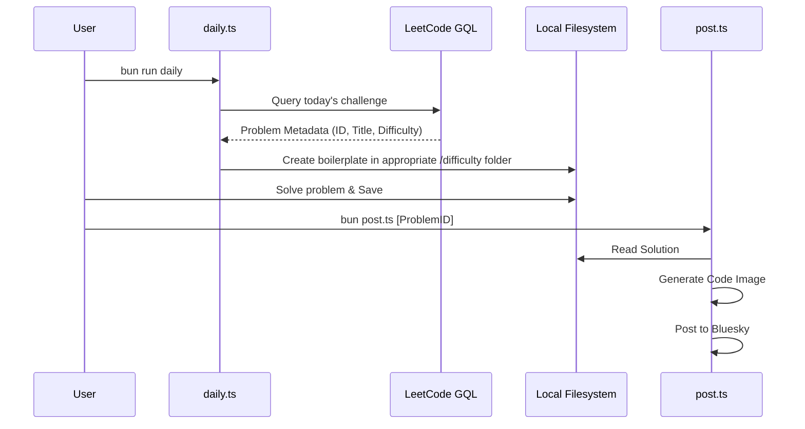

<!--
  Generated by AI-Powered README Generator
  Repository: https://github.com/WomB0ComB0/leetcode
  Generated: 2026-01-25T06:07:29.029Z
  Format: md
  Style: comprehensive
-->

# LeetCode Solutions Repository

A robust, multilingual ecosystem for solving, managing, and sharing LeetCode competitive programming
challenges with automated linting and social integration.


## Table of Contents

- [Overview](#overview)
- [Features](#features)
- [Architecture](#architecture)
- [Quick Start](#quick-start)
- [Usage & Examples](#usage--examples)
- [Configuration](#configuration)
- [API Reference](#api-reference)
- [Development](#development)
- [Contributing](#contributing)
- [Roadmap & Known Issues](#roadmap--known-issues)
- [License & Credits](#license--credits)

## Overview

The **LeetCode Solutions Repository** is more than just a collection of code; it is a developer
framework designed to streamline the workflow of competitive programmers. Managing over 10,000
solution files across a dozen programming languages requires more than just folders—it requires
automation.

This project solves the problem of "context switching" between different language environments by
providing a unified CLI interface powered by Bun. Whether you are solving the daily challenge in
Python, optimizing a C++ algorithm, or practicing TypeScript, the repository handles the
boilerplate, file naming conventions, code quality enforcement, and even the social sharing aspect
of your progress.

**Who is this for?**
- 🎓 **Students** preparing for technical interviews.
- 👨‍💻 **Software Engineers** maintaining their algorithmic skills.
- 🧪 **Polyglots** looking for a standardized way to compare language performance.
- 📢 **Content Creators** who want to automate posting solutions to social media.

## Features

### ✨ Core Capabilities
- 🌍 **Multilingual Hub:** Full support for Python, TypeScript, JavaScript, Java, C++, C, C#, Dart,
  PHP, Go, Rust, Ruby, Swift, and Kotlin.
- 🤖 **Daily Automation:** Integrated fetcher to retrieve the current LeetCode daily challenge via
  GQL.
- 🧹 **Intelligent Cleanup:** A TypeScript-based utility (`clean.ts`) that standardizes over 10k
  filenames into `kebab-case` and handles Roman numeral deduplication.
- 🔍 **Unified Linting:** A master `lint.sh` script that orchestrates language-specific linters
  (Biome, Black, Checkstyle, clang-tidy, etc.) to ensure production-grade code quality.

### ⚡ Automation & Integration
- 📸 **Code-to-Image:** Automatic generation of syntax-highlighted images from solution files.
- 🦋 **Social Synergy:** Built-in integration with Bluesky for automated solution posting.
- 🛠️ **Environment Sync:** A `config.sh` tool that dynamically generates project files
  (`Cargo.toml`, `pom.xml`, `package.json`) to keep local IDEs in sync with the repository.

## Architecture

### System Component Diagram
The system is divided into the **Automation Layer** (handling external interactions and
orchestration) and the **Solution Domain** (the physical organization of algorithms).

```mermaid
graph TD
    subgraph "Automation Layer (Bun/TypeScript)"
        Daily[daily.ts - Challenge Fetcher]
        Clean[clean.ts - Filename Standardizer]
        Post[post.ts - Social Media Integration]
        Config[config.ts - Env Generator]
    end

    subgraph "Solution Domain (Filesystem)"
        Py[Python]
        CPP[C++]
        TS[TypeScript]
        LangX[Other Languages...]
        DiffE[Easy]
        DiffM[Medium]
        DiffH[Hard]
    end

    subgraph "External Integration"
        LC{{LeetCode API}}
        BS{{Bluesky Social}}
        ImgGen[Image Generation Service]
    end

    Daily --> |GraphQL| LC
    Daily --> |Writes| DiffE
    Clean --> |Refactors| Solution Domain
    Post --> |Reads| Solution Domain
    Post --> |Uploads| BS
    Config --> |Scaffolds| Solution Domain
```

### Data Flow: Daily Challenge Lifecycle
This sequence tracks how a problem moves from LeetCode into the repository and out to social media.



### Tech Stack Table
| Layer | Technology | Purpose |
| :--- | :--- | :--- |
| Runtime | [Bun](https://bun.sh/) | Execution of TypeScript automation scripts. |
| Automation | TypeScript | Logic for fetching, cleaning, and social posting. |
| Formatting | Biome / Clang-Format | Standardizing JS/TS/C/C++ code style. |
| Workflow | Bash | Orchestrating multi-language linting scripts. |
| Versioning | Git | Tracking 10,000+ algorithm implementations. |

## Quick Start

### Prerequisites
- **Git**: 2.30+
- **Bun**: 1.1.0+ (Required for script execution)
- **Bash**: For running orchestration scripts.

### Installation
1. Clone the repository and navigate to the directory:
```bash
git clone https://github.com/WomB0ComB0/leetcode.git
cd leetcode
```

2. Initialize the multilingual configurations:
```bash
chmod +x config.sh
./config.sh
```

3. (Optional) Run the cleanup script to ensure naming consistency:
```bash
bun run clean.ts
```

### Hello World (Fetch Today's Challenge)
Run the following command to automatically pull the daily LeetCode challenge metadata and create a
solution file:
```bash
bun run daily.ts
```
**Expected Output:**
> Successfully fetched "2684. Maximum Number of Moves in a Grid"
> Created boilerplate: `python/medium/2684-maximum-number-of-moves-in-a-grid.py`

## Usage & Examples

### 1. Organizing Solutions
Solutions are strictly organized by language and difficulty level to ensure discoverability.

**Structure:**
- `cpp/easy/1-two-sum.cpp`
- `python/hard/10-regular-expression-matching.py`
- `typescript/medium/2-add-two-numbers.ts`

### 2. Code Quality Enforcement
Before submitting a PR, run the master linting script. It detects which languages you have modified
and applies the correct toolset.
```bash
./lint.sh
```

### 3. Social Media Sharing
To share your solution to Bluesky with an autogenerated code snippet image:
```bash
bun post.ts <problem-id>
# Example
bun post.ts 2684
```

<details>
<summary>Advanced: Filename Cleaning Logic</summary>

The `clean.ts` script performs complex regex transformations to maintain a massive repo:
- Removes special characters.
- Converts `CamelCase` and `PascalCase` to `kebab-case`.
- Detects numeric patterns and ensures they follow the `[ID]-[Slug].[Ext]` format.
- Automatically handles Roman numeral suffixes for problem variants.
</details>

## Configuration

### Environment Variables
For social media integration, create a `.env` file in the root (based on `config.sh` output):

| Variable | Required | Default | Description |
| :--- | :--- | :--- | :--- |
| `BSKY_HANDLE` | No* | - | Your Bluesky identifier (e.g., user.bsky.social). |
| `BSKY_PASSWORD` | No* | - | App-specific password for Bluesky. |
| `LEETCODE_SESSION` | No | - | Required if fetching premium-only problem data. |

*\*Only required if using `post.ts`.*

### Tooling Configs
The repository uses several local configuration files:
- `biome.json`: Rules for JS/TS formatting (Space indent, 100 char line limit).
- `.clang-format`: LLVM-style rules for C/C++.
- `.golangci.yml`: Standard Go linting rules.

## API Reference

### Internal TypeScript Modules

#### `clean.ts`
Utility functions for maintaining repository health.

| Function | Parameters | Return | Description |
| :--- | :--- | :--- | :--- |
| `toKebabCase` | `str: string` | `string` | Converts any string to a URL-safe kebab-case. |
| `toRoman` | `num: number` | `string` | Converts integers to Roman numerals (deduping). |
| `cleanFilenames`| `dir: string` | `Promise` | Recursively renames all files in a lang directory. |

**Example:**
```typescript
import { toKebabCase } from "./clean";

console.log(toKebabCase("Two Sum II")); 
// Output: "two-sum-ii"
```

#### `daily.ts`
The core logic for interacting with LeetCode's GQL endpoint.

**Input:** None (Interactive or automated).
**Output:** Creates a file in `[lang]/[difficulty]/[id]-[slug].[ext]`.

## Development

### Setup Local Workspace
```bash
# Install Bun dependencies
bun install

# Run tests (if applicable)
bun test
```

### Directory Map
- `c/`, `cpp/`, `csharp/`, `dart/`, `go/`, `java/`, `python/`, `rust/`, `typescript/`: Solutions.
- `.github/workflows/`: CI/CD logic for daily updates.
- `constant.ts`: Mapping of language extensions and difficulty labels.

### Code Style
- **TS/JS:** Managed by Biome. Run `bunx @biomejs/biome format --write .`.
- **C/C++:** Managed by Clang. Run `clang-format -i path/to/file`.
- **Python:** Managed by Black. Run `black .`.

## Contributing

1. **Branching:** Use `feature/[problem-id]` or `fix/[language]`.
2. **Standardization:** Ensure filenames are kebab-case before pushing.
3. **Quality:** Run `./lint.sh` and fix all warnings.
4. **Commits:** Use conventional commits (e.g., `feat(python): add solution for 242`).

> **Warning:** Do not manually edit the main `README.md` TOC; it is periodically updated by
> automation scripts.

## Roadmap & Known Issues

- [ ] **Roadmap:** Integration for X (formerly Twitter) posting.
- [ ] **Roadmap:** Support for Rust `cargo test` integration per solution.
- [ ] **Roadmap:** Interactive TUI for selecting solutions to post.
- ⚠️ **Issue:** `clean.ts` might misidentify Roman numerals in problems that have numbers as part of
  their title (e.g., "3Sum").
- ⚠️ **Issue:** Social media image generation requires high memory for very long solutions (>300
  lines).

## License & Credits

### License
This project is licensed under the **MIT License**. See `LICENSE` for details.

### Acknowledgments
- **LeetCode:** For providing the platform and API.
- **Biome:** For the lightning-fast linting logic.
- **Bluesky:** For the open API enabling easy automation.

**Maintainer:** [WomB0ComB0](https://github.com/WomB0ComB0)